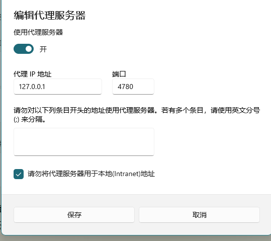

#### Failed to connect to github.com port 443 after ***** ms: Couldn‘t connect to server
> 解决方法:设置---网络和Internet---代理---地址:端口  

修改git配置:

git config --global http.proxy http://127.0.0.1:4780
git config --global https.proxy http://127.0.0.1:4780

再执行**git clone**即可

如果不行则取消代理
git config --global --unset http.proxy

git config --global --unset https.proxy